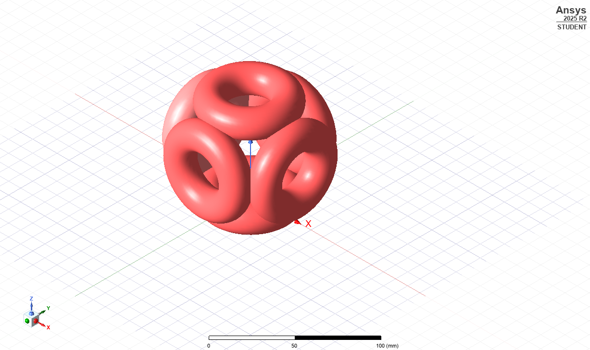
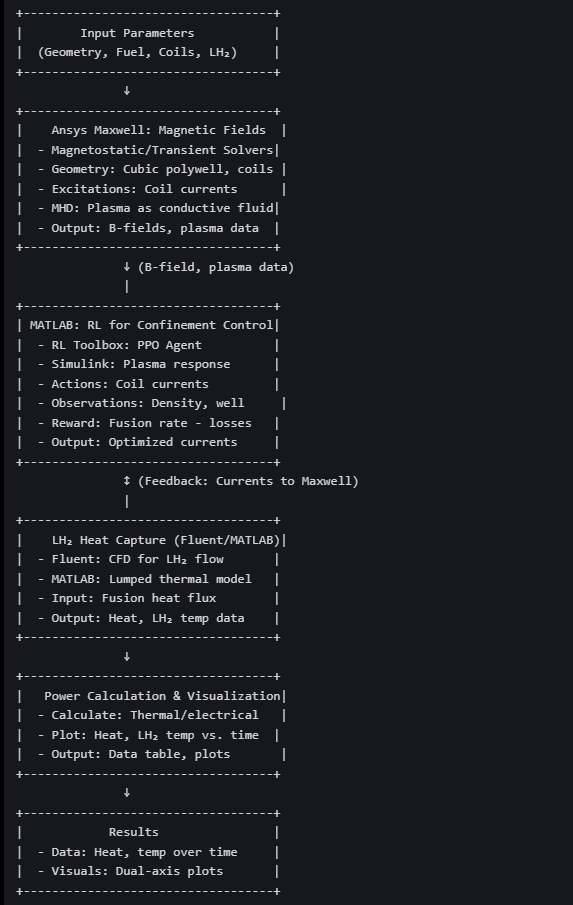
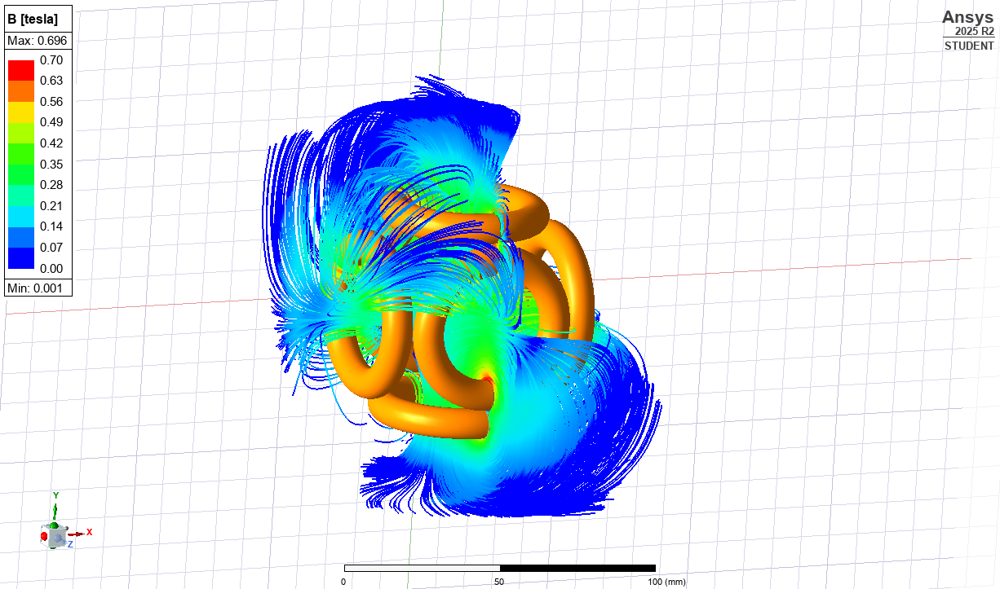

# Polywell_RL-magnetic-control-sys.
**What This Simulation Does**

This is a complete end-to-end simulation of a Polywell fusion reactor where reinforcement learning (RL) in MATLAB controls the magnetic field by adjusting coil currents in ANSYS Maxwell, which then affects plasma confinement, leading to fusion reactions, producing neutrons, and generating power from heat absorbed through by liquid hydrogen introduced around the Polywell geometry.

**Polywell Fusion Concept**

What is Polywell?

A Polywell is a type of fusion reactor that uses 6 circular magnetic coils arranged at the faces of a cube. These coils create a magnetic field configuration called "magnetic cusps" that confines plasma.

Why This Design?

-   **6 coils** create a spherical magnetic "bottle"
-   Plasma particles spiral along magnetic field lines
-   At the **center**: Magnetic field is WEAK → plasma confined
-   At the **edges**: Magnetic field is STRONG → particles reflect back
-   **Cusps** (where coils meet): Particles can escape if field is wrong

**Workflow structure**

1. Inputs: Define polywell geometry, fusion fuel, coil setup, and LH₂ coolant parameters.
2. Ansys Maxwell: Simulates magnetic cusp fields and plasma response (MHD approximation). Exports field and plasma data to MATLAB.
3. MATLAB RL: Uses PPO agent to optimize coil currents for confinement, feeding adjustments back to Maxwell via AEDT API.
4. LH₂ Heat Capture: Models heat absorption by LH₂ using Fluent (CFD) or MATLAB (lumped model). Outputs heat and temperature data.
5. Power & Visualization: Computes power metrics, generates dual-axis plots (heat and LH₂ temperature vs. time).

